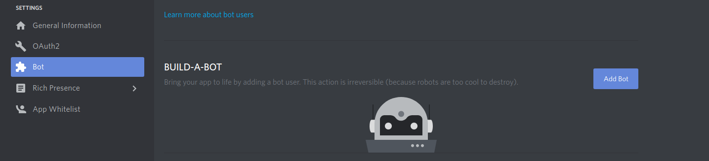

# VocalCraft API

Provide discord bot to handle VocalCraft java plugin

## Getting Started

first of all, you'll need to clone this repo.
### Create bot
Then, browse to [Discord developper](https://discordapp.com/developers/applications/)

create a new application

go to bot section and add a new bot



when done, hit copy button to copy secret key.

### edit environements

go back to VocalCraft and edit environements with your secret key from bot

### enable bot
to enable the bot on your server, you only need your client id


replace your-client-id in the url by yours

https://discordapp.com/oauth2/authorize?client_id=your-client-id&scope=bot&permissions=8

you'll have a dropdown with the list of all your guilds. Select the good one and the bot is added
### finish environement

go to discord and go to settings -> apparence -> Mode développeur and enable it

then, go back to discord home and right click on your guild and copy id to VocalCraft environement


### Prerequisites


* NodeJs > 8.0.0
* npm > 6.0.0

### Installing


```
npm install
```
## Running the tests

```
npm run test
```

## Authors

* **Maddoctor** - *Initial work* - [Enoviah](https://enoviah.fr)


## License

This project is licensed under the MIT License - see the [LICENSE.md](LICENSE.md) file for details
